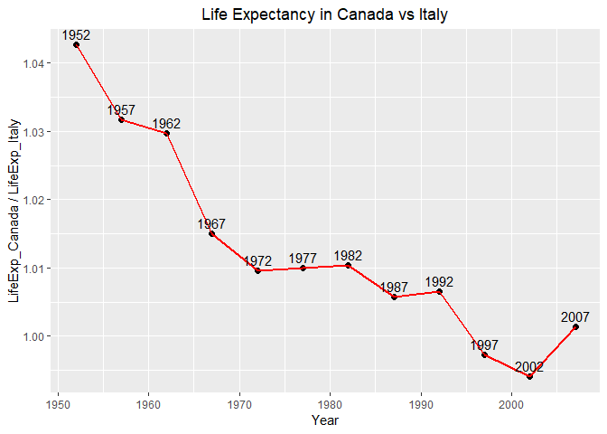

hw04-Tidy data and joins
================

# Introduction

The goal of this homework is to solidify data wrangling skills by
working some realistic problems in the grey area between data
aggregation and data reshaping.

For this assignment, we have been tasked with two prompts. The first
will be a data reshaping prompt while the second will be a data joining
prompt.

``` r
suppressPackageStartupMessages(library(tidyverse))
library(knitr)
library(gapminder)
```

# Data Reshaping (Activity \#2)

**Problem**: Make a tibble with one row per year and columns for life
expectancy for two or more countries.

**Solution**: Let’s make a table comparing life expectancies between
Canada and Italy over the years sampled in the `gapminder` dataset.
Specifically, we want each row to represent a year and have a column for
each country that records life expectancy in that year.

``` r
table1 <- gapminder %>% 
  filter(country == "Canada" | country == "Italy") %>% 
  select(year,country,lifeExp) %>% 
  spread(key=country, value=lifeExp) 
kable(table1, caption = "LifeExp in Canada vs Italy",
      table.placement = "tbp", 
      caption.placement = "top", # table and title position
      col.names = c(" Year ", " LifeExp_Canada ", " LifeExp_Italy ")) # add title, edit columns names
```

| Year | LifeExp\_Canada | LifeExp\_Italy |
| :--: | :-------------: | :------------: |
| 1952 |     68.750      |     65.940     |
| 1957 |     69.960      |     67.810     |
| 1962 |     71.300      |     69.240     |
| 1967 |     72.130      |     71.060     |
| 1972 |     72.880      |     72.190     |
| 1977 |     74.210      |     73.480     |
| 1982 |     75.760      |     74.980     |
| 1987 |     76.860      |     76.420     |
| 1992 |     77.950      |     77.440     |
| 1997 |     78.610      |     78.820     |
| 2002 |     79.770      |     80.240     |
| 2007 |     80.653      |     80.546     |

LifeExp in Canada vs Italy

From the table above, we get the lifeExp for Canada and France. Now,
let’s make a plot of life expectancy for Canada against France which
will be visually appealing.

``` r
table1 %>% 
  ggplot(aes(year,Canada/Italy))+
  geom_point(size=2)+
  geom_line(color="red",size=1)+
  geom_text(aes(label = year),hjust = 0.5, vjust = -0.5)+
  # adjust the position of marks
  labs(title="Life Expectancy in Canada vs Italy",x = "Year", y = "LifeExp_Canada / LifeExp_Italy")+
  # add title, lable x and y axis
  theme(plot.title = element_text(hjust = 0.5)) #center the title
```

<!-- -->

From the graph above, it’s clear that Canada has a higher life
expectancy over Italy except in 1997 and 2002.And the difference between
the life expectancies of these two countries is going to be smaller and
smaller.

# Data Joining (Activity \#1)

**Problem**: Create a second data frame, complementary to Gapminder.
Join this with (part of) Gapminder using a dplyr join function and make
some observations about the process and result. Explore the different
types of joins.

**Solution**: Let’s use `LifeCycleSavings` which is a built-in data
frame in r as the second data frame. `LifeCycleSavings` is a dataset
which contains 50 observations on 5 variables.

| Variable |            Description            |
| -------- | :-------------------------------: |
| sr       |    aggregate personal savings     |
| pop15    |     % of population under 15      |
| pop75    |      % of population over 75      |
| dpi      | real per-capita disposable income |
| ddpi     |        growth rate of dpi         |

Let’s take a look at this dataset and select two varibles from it.The
new dataset we get is called `mytable`.

``` r
mytable <- LifeCycleSavings %>% 
  select(sr,dpi) %>% 
  rownames_to_column("country") %>% 
# convert the row names into first column
  mutate_if(is.factor, as.character)
kable(mytable)
```

| country        |    sr |     dpi |
| :------------- | ----: | ------: |
| Australia      | 11.43 | 2329.68 |
| Austria        | 12.07 | 1507.99 |
| Belgium        | 13.17 | 2108.47 |
| Bolivia        |  5.75 |  189.13 |
| Brazil         | 12.88 |  728.47 |
| Canada         |  8.79 | 2982.88 |
| Chile          |  0.60 |  662.86 |
| China          | 11.90 |  289.52 |
| Colombia       |  4.98 |  276.65 |
| Costa Rica     | 10.78 |  471.24 |
| Denmark        | 16.85 | 2496.53 |
| Ecuador        |  3.59 |  287.77 |
| Finland        | 11.24 | 1681.25 |
| France         | 12.64 | 2213.82 |
| Germany        | 12.55 | 2457.12 |
| Greece         | 10.67 |  870.85 |
| Guatamala      |  3.01 |  289.71 |
| Honduras       |  7.70 |  232.44 |
| Iceland        |  1.27 | 1900.10 |
| India          |  9.00 |   88.94 |
| Ireland        | 11.34 | 1139.95 |
| Italy          | 14.28 | 1390.00 |
| Japan          | 21.10 | 1257.28 |
| Korea          |  3.98 |  207.68 |
| Luxembourg     | 10.35 | 2449.39 |
| Malta          | 15.48 |  601.05 |
| Norway         | 10.25 | 2231.03 |
| Netherlands    | 14.65 | 1740.70 |
| New Zealand    | 10.67 | 1487.52 |
| Nicaragua      |  7.30 |  325.54 |
| Panama         |  4.44 |  568.56 |
| Paraguay       |  2.02 |  220.56 |
| Peru           | 12.70 |  400.06 |
| Philippines    | 12.78 |  152.01 |
| Portugal       | 12.49 |  579.51 |
| South Africa   | 11.14 |  651.11 |
| South Rhodesia | 13.30 |  250.96 |
| Spain          | 11.77 |  768.79 |
| Sweden         |  6.86 | 3299.49 |
| Switzerland    | 14.13 | 2630.96 |
| Turkey         |  5.13 |  389.66 |
| Tunisia        |  2.81 |  249.87 |
| United Kingdom |  7.81 | 1813.93 |
| United States  |  7.56 | 4001.89 |
| Venezuela      |  9.22 |  813.39 |
| Zambia         | 18.56 |  138.33 |
| Jamaica        |  7.72 |  380.47 |
| Uruguay        |  9.24 |  766.54 |
| Libya          |  8.89 |  123.58 |
| Malaysia       |  4.71 |  242.69 |

## mutating join

### left\_join and right\_join

Let’s use left\_join and right\_join seperately to join part of
gapminder(4 columns, 142 rows) and mytable(3 columns, 50 rows) together.

``` r
gapminder %>% 
  filter(year == 1967) %>% 
  select(country,continent,year,gdpPercap) %>%  #add a restriction to get a smaller data set %>% 
  left_join(mytable,by=c("country")) %>% 
  kable()
```

    ## Warning: Column `country` joining factor and character vector, coercing
    ## into character vector

| country                  | continent | year |  gdpPercap |    sr |     dpi |
| :----------------------- | :-------- | ---: | ---------: | ----: | ------: |
| Afghanistan              | Asia      | 1967 |   836.1971 |    NA |      NA |
| Albania                  | Europe    | 1967 |  2760.1969 |    NA |      NA |
| Algeria                  | Africa    | 1967 |  3246.9918 |    NA |      NA |
| Angola                   | Africa    | 1967 |  5522.7764 |    NA |      NA |
| Argentina                | Americas  | 1967 |  8052.9530 |    NA |      NA |
| Australia                | Oceania   | 1967 | 14526.1246 | 11.43 | 2329.68 |
| Austria                  | Europe    | 1967 | 12834.6024 | 12.07 | 1507.99 |
| Bahrain                  | Asia      | 1967 | 14804.6727 |    NA |      NA |
| Bangladesh               | Asia      | 1967 |   721.1861 |    NA |      NA |
| Belgium                  | Europe    | 1967 | 13149.0412 | 13.17 | 2108.47 |
| Benin                    | Africa    | 1967 |  1035.8314 |    NA |      NA |
| Bolivia                  | Americas  | 1967 |  2586.8861 |  5.75 |  189.13 |
| Bosnia and Herzegovina   | Europe    | 1967 |  2172.3524 |    NA |      NA |
| Botswana                 | Africa    | 1967 |  1214.7093 |    NA |      NA |
| Brazil                   | Americas  | 1967 |  3429.8644 | 12.88 |  728.47 |
| Bulgaria                 | Europe    | 1967 |  5577.0028 |    NA |      NA |
| Burkina Faso             | Africa    | 1967 |   794.8266 |    NA |      NA |
| Burundi                  | Africa    | 1967 |   412.9775 |    NA |      NA |
| Cambodia                 | Asia      | 1967 |   523.4323 |    NA |      NA |
| Cameroon                 | Africa    | 1967 |  1508.4531 |    NA |      NA |
| Canada                   | Americas  | 1967 | 16076.5880 |  8.79 | 2982.88 |
| Central African Republic | Africa    | 1967 |  1136.0566 |    NA |      NA |
| Chad                     | Africa    | 1967 |  1196.8106 |    NA |      NA |
| Chile                    | Americas  | 1967 |  5106.6543 |  0.60 |  662.86 |
| China                    | Asia      | 1967 |   612.7057 | 11.90 |  289.52 |
| Colombia                 | Americas  | 1967 |  2678.7298 |  4.98 |  276.65 |
| Comoros                  | Africa    | 1967 |  1876.0296 |    NA |      NA |
| Congo, Dem. Rep.         | Africa    | 1967 |   861.5932 |    NA |      NA |
| Congo, Rep.              | Africa    | 1967 |  2677.9396 |    NA |      NA |
| Costa Rica               | Americas  | 1967 |  4161.7278 | 10.78 |  471.24 |
| Cote d’Ivoire            | Africa    | 1967 |  2052.0505 |    NA |      NA |
| Croatia                  | Europe    | 1967 |  6960.2979 |    NA |      NA |
| Cuba                     | Americas  | 1967 |  5690.2680 |    NA |      NA |
| Czech Republic           | Europe    | 1967 | 11399.4449 |    NA |      NA |
| Denmark                  | Europe    | 1967 | 15937.2112 | 16.85 | 2496.53 |
| Djibouti                 | Africa    | 1967 |  3020.0505 |    NA |      NA |
| Dominican Republic       | Americas  | 1967 |  1653.7230 |    NA |      NA |
| Ecuador                  | Americas  | 1967 |  4579.0742 |  3.59 |  287.77 |
| Egypt                    | Africa    | 1967 |  1814.8807 |    NA |      NA |
| El Salvador              | Americas  | 1967 |  4358.5954 |    NA |      NA |
| Equatorial Guinea        | Africa    | 1967 |   915.5960 |    NA |      NA |
| Eritrea                  | Africa    | 1967 |   468.7950 |    NA |      NA |
| Ethiopia                 | Africa    | 1967 |   516.1186 |    NA |      NA |
| Finland                  | Europe    | 1967 | 10921.6363 | 11.24 | 1681.25 |
| France                   | Europe    | 1967 | 12999.9177 | 12.64 | 2213.82 |
| Gabon                    | Africa    | 1967 |  8358.7620 |    NA |      NA |
| Gambia                   | Africa    | 1967 |   734.7829 |    NA |      NA |
| Germany                  | Europe    | 1967 | 14745.6256 | 12.55 | 2457.12 |
| Ghana                    | Africa    | 1967 |  1125.6972 |    NA |      NA |
| Greece                   | Europe    | 1967 |  8513.0970 | 10.67 |  870.85 |
| Guatemala                | Americas  | 1967 |  3242.5311 |    NA |      NA |
| Guinea                   | Africa    | 1967 |   708.7595 |    NA |      NA |
| Guinea-Bissau            | Africa    | 1967 |   715.5806 |    NA |      NA |
| Haiti                    | Americas  | 1967 |  1452.0577 |    NA |      NA |
| Honduras                 | Americas  | 1967 |  2538.2694 |  7.70 |  232.44 |
| Hong Kong, China         | Asia      | 1967 |  6197.9628 |    NA |      NA |
| Hungary                  | Europe    | 1967 |  9326.6447 |    NA |      NA |
| Iceland                  | Europe    | 1967 | 13319.8957 |  1.27 | 1900.10 |
| India                    | Asia      | 1967 |   700.7706 |  9.00 |   88.94 |
| Indonesia                | Asia      | 1967 |   762.4318 |    NA |      NA |
| Iran                     | Asia      | 1967 |  5906.7318 |    NA |      NA |
| Iraq                     | Asia      | 1967 |  8931.4598 |    NA |      NA |
| Ireland                  | Europe    | 1967 |  7655.5690 | 11.34 | 1139.95 |
| Israel                   | Asia      | 1967 |  8393.7414 |    NA |      NA |
| Italy                    | Europe    | 1967 | 10022.4013 | 14.28 | 1390.00 |
| Jamaica                  | Americas  | 1967 |  6124.7035 |  7.72 |  380.47 |
| Japan                    | Asia      | 1967 |  9847.7886 | 21.10 | 1257.28 |
| Jordan                   | Asia      | 1967 |  2741.7963 |    NA |      NA |
| Kenya                    | Africa    | 1967 |  1056.7365 |    NA |      NA |
| Korea, Dem. Rep.         | Asia      | 1967 |  2143.5406 |    NA |      NA |
| Korea, Rep.              | Asia      | 1967 |  2029.2281 |    NA |      NA |
| Kuwait                   | Asia      | 1967 | 80894.8833 |    NA |      NA |
| Lebanon                  | Asia      | 1967 |  6006.9830 |    NA |      NA |
| Lesotho                  | Africa    | 1967 |   498.6390 |    NA |      NA |
| Liberia                  | Africa    | 1967 |   713.6036 |    NA |      NA |
| Libya                    | Africa    | 1967 | 18772.7517 |  8.89 |  123.58 |
| Madagascar               | Africa    | 1967 |  1634.0473 |    NA |      NA |
| Malawi                   | Africa    | 1967 |   495.5148 |    NA |      NA |
| Malaysia                 | Asia      | 1967 |  2277.7424 |  4.71 |  242.69 |
| Mali                     | Africa    | 1967 |   545.0099 |    NA |      NA |
| Mauritania               | Africa    | 1967 |  1421.1452 |    NA |      NA |
| Mauritius                | Africa    | 1967 |  2475.3876 |    NA |      NA |
| Mexico                   | Americas  | 1967 |  5754.7339 |    NA |      NA |
| Mongolia                 | Asia      | 1967 |  1226.0411 |    NA |      NA |
| Montenegro               | Europe    | 1967 |  5907.8509 |    NA |      NA |
| Morocco                  | Africa    | 1967 |  1711.0448 |    NA |      NA |
| Mozambique               | Africa    | 1967 |   566.6692 |    NA |      NA |
| Myanmar                  | Asia      | 1967 |   349.0000 |    NA |      NA |
| Namibia                  | Africa    | 1967 |  3793.6948 |    NA |      NA |
| Nepal                    | Asia      | 1967 |   676.4422 |    NA |      NA |
| Netherlands              | Europe    | 1967 | 15363.2514 | 14.65 | 1740.70 |
| New Zealand              | Oceania   | 1967 | 14463.9189 | 10.67 | 1487.52 |
| Nicaragua                | Americas  | 1967 |  4643.3935 |  7.30 |  325.54 |
| Niger                    | Africa    | 1967 |  1054.3849 |    NA |      NA |
| Nigeria                  | Africa    | 1967 |  1014.5141 |    NA |      NA |
| Norway                   | Europe    | 1967 | 16361.8765 | 10.25 | 2231.03 |
| Oman                     | Asia      | 1967 |  4720.9427 |    NA |      NA |
| Pakistan                 | Asia      | 1967 |   942.4083 |    NA |      NA |
| Panama                   | Americas  | 1967 |  4421.0091 |  4.44 |  568.56 |
| Paraguay                 | Americas  | 1967 |  2299.3763 |  2.02 |  220.56 |
| Peru                     | Americas  | 1967 |  5788.0933 | 12.70 |  400.06 |
| Philippines              | Asia      | 1967 |  1814.1274 | 12.78 |  152.01 |
| Poland                   | Europe    | 1967 |  6557.1528 |    NA |      NA |
| Portugal                 | Europe    | 1967 |  6361.5180 | 12.49 |  579.51 |
| Puerto Rico              | Americas  | 1967 |  6929.2777 |    NA |      NA |
| Reunion                  | Africa    | 1967 |  4021.1757 |    NA |      NA |
| Romania                  | Europe    | 1967 |  6470.8665 |    NA |      NA |
| Rwanda                   | Africa    | 1967 |   510.9637 |    NA |      NA |
| Sao Tome and Principe    | Africa    | 1967 |  1384.8406 |    NA |      NA |
| Saudi Arabia             | Asia      | 1967 | 16903.0489 |    NA |      NA |
| Senegal                  | Africa    | 1967 |  1612.4046 |    NA |      NA |
| Serbia                   | Europe    | 1967 |  7991.7071 |    NA |      NA |
| Sierra Leone             | Africa    | 1967 |  1206.0435 |    NA |      NA |
| Singapore                | Asia      | 1967 |  4977.4185 |    NA |      NA |
| Slovak Republic          | Europe    | 1967 |  8412.9024 |    NA |      NA |
| Slovenia                 | Europe    | 1967 |  9405.4894 |    NA |      NA |
| Somalia                  | Africa    | 1967 |  1284.7332 |    NA |      NA |
| South Africa             | Africa    | 1967 |  7114.4780 | 11.14 |  651.11 |
| Spain                    | Europe    | 1967 |  7993.5123 | 11.77 |  768.79 |
| Sri Lanka                | Asia      | 1967 |  1135.5143 |    NA |      NA |
| Sudan                    | Africa    | 1967 |  1687.9976 |    NA |      NA |
| Swaziland                | Africa    | 1967 |  2613.1017 |    NA |      NA |
| Sweden                   | Europe    | 1967 | 15258.2970 |  6.86 | 3299.49 |
| Switzerland              | Europe    | 1967 | 22966.1443 | 14.13 | 2630.96 |
| Syria                    | Asia      | 1967 |  1881.9236 |    NA |      NA |
| Taiwan                   | Asia      | 1967 |  2643.8587 |    NA |      NA |
| Tanzania                 | Africa    | 1967 |   848.2187 |    NA |      NA |
| Thailand                 | Asia      | 1967 |  1295.4607 |    NA |      NA |
| Togo                     | Africa    | 1967 |  1477.5968 |    NA |      NA |
| Trinidad and Tobago      | Americas  | 1967 |  5621.3685 |    NA |      NA |
| Tunisia                  | Africa    | 1967 |  1932.3602 |  2.81 |  249.87 |
| Turkey                   | Europe    | 1967 |  2826.3564 |  5.13 |  389.66 |
| Uganda                   | Africa    | 1967 |   908.9185 |    NA |      NA |
| United Kingdom           | Europe    | 1967 | 14142.8509 |  7.81 | 1813.93 |
| United States            | Americas  | 1967 | 19530.3656 |  7.56 | 4001.89 |
| Uruguay                  | Americas  | 1967 |  5444.6196 |  9.24 |  766.54 |
| Venezuela                | Americas  | 1967 |  9541.4742 |  9.22 |  813.39 |
| Vietnam                  | Asia      | 1967 |   637.1233 |    NA |      NA |
| West Bank and Gaza       | Asia      | 1967 |  2649.7150 |    NA |      NA |
| Yemen, Rep.              | Asia      | 1967 |   862.4421 |    NA |      NA |
| Zambia                   | Africa    | 1967 |  1777.0773 | 18.56 |  138.33 |
| Zimbabwe                 | Africa    | 1967 |   569.7951 |    NA |      NA |

``` r
gapminder %>% 
  filter(year == 1967) %>% 
  select(country,continent,year,gdpPercap) %>% #add a restriction to get a smaller data set
  right_join(mytable,by=c("country")) %>% 
  kable()
```

    ## Warning: Column `country` joining factor and character vector, coercing
    ## into character vector

| country        | continent | year |  gdpPercap |    sr |     dpi |
| :------------- | :-------- | ---: | ---------: | ----: | ------: |
| Australia      | Oceania   | 1967 | 14526.1246 | 11.43 | 2329.68 |
| Austria        | Europe    | 1967 | 12834.6024 | 12.07 | 1507.99 |
| Belgium        | Europe    | 1967 | 13149.0412 | 13.17 | 2108.47 |
| Bolivia        | Americas  | 1967 |  2586.8861 |  5.75 |  189.13 |
| Brazil         | Americas  | 1967 |  3429.8644 | 12.88 |  728.47 |
| Canada         | Americas  | 1967 | 16076.5880 |  8.79 | 2982.88 |
| Chile          | Americas  | 1967 |  5106.6543 |  0.60 |  662.86 |
| China          | Asia      | 1967 |   612.7057 | 11.90 |  289.52 |
| Colombia       | Americas  | 1967 |  2678.7298 |  4.98 |  276.65 |
| Costa Rica     | Americas  | 1967 |  4161.7278 | 10.78 |  471.24 |
| Denmark        | Europe    | 1967 | 15937.2112 | 16.85 | 2496.53 |
| Ecuador        | Americas  | 1967 |  4579.0742 |  3.59 |  287.77 |
| Finland        | Europe    | 1967 | 10921.6363 | 11.24 | 1681.25 |
| France         | Europe    | 1967 | 12999.9177 | 12.64 | 2213.82 |
| Germany        | Europe    | 1967 | 14745.6256 | 12.55 | 2457.12 |
| Greece         | Europe    | 1967 |  8513.0970 | 10.67 |  870.85 |
| Guatamala      | NA        |   NA |         NA |  3.01 |  289.71 |
| Honduras       | Americas  | 1967 |  2538.2694 |  7.70 |  232.44 |
| Iceland        | Europe    | 1967 | 13319.8957 |  1.27 | 1900.10 |
| India          | Asia      | 1967 |   700.7706 |  9.00 |   88.94 |
| Ireland        | Europe    | 1967 |  7655.5690 | 11.34 | 1139.95 |
| Italy          | Europe    | 1967 | 10022.4013 | 14.28 | 1390.00 |
| Japan          | Asia      | 1967 |  9847.7886 | 21.10 | 1257.28 |
| Korea          | NA        |   NA |         NA |  3.98 |  207.68 |
| Luxembourg     | NA        |   NA |         NA | 10.35 | 2449.39 |
| Malta          | NA        |   NA |         NA | 15.48 |  601.05 |
| Norway         | Europe    | 1967 | 16361.8765 | 10.25 | 2231.03 |
| Netherlands    | Europe    | 1967 | 15363.2514 | 14.65 | 1740.70 |
| New Zealand    | Oceania   | 1967 | 14463.9189 | 10.67 | 1487.52 |
| Nicaragua      | Americas  | 1967 |  4643.3935 |  7.30 |  325.54 |
| Panama         | Americas  | 1967 |  4421.0091 |  4.44 |  568.56 |
| Paraguay       | Americas  | 1967 |  2299.3763 |  2.02 |  220.56 |
| Peru           | Americas  | 1967 |  5788.0933 | 12.70 |  400.06 |
| Philippines    | Asia      | 1967 |  1814.1274 | 12.78 |  152.01 |
| Portugal       | Europe    | 1967 |  6361.5180 | 12.49 |  579.51 |
| South Africa   | Africa    | 1967 |  7114.4780 | 11.14 |  651.11 |
| South Rhodesia | NA        |   NA |         NA | 13.30 |  250.96 |
| Spain          | Europe    | 1967 |  7993.5123 | 11.77 |  768.79 |
| Sweden         | Europe    | 1967 | 15258.2970 |  6.86 | 3299.49 |
| Switzerland    | Europe    | 1967 | 22966.1443 | 14.13 | 2630.96 |
| Turkey         | Europe    | 1967 |  2826.3564 |  5.13 |  389.66 |
| Tunisia        | Africa    | 1967 |  1932.3602 |  2.81 |  249.87 |
| United Kingdom | Europe    | 1967 | 14142.8509 |  7.81 | 1813.93 |
| United States  | Americas  | 1967 | 19530.3656 |  7.56 | 4001.89 |
| Venezuela      | Americas  | 1967 |  9541.4742 |  9.22 |  813.39 |
| Zambia         | Africa    | 1967 |  1777.0773 | 18.56 |  138.33 |
| Jamaica        | Americas  | 1967 |  6124.7035 |  7.72 |  380.47 |
| Uruguay        | Americas  | 1967 |  5444.6196 |  9.24 |  766.54 |
| Libya          | Africa    | 1967 | 18772.7517 |  8.89 |  123.58 |
| Malaysia       | Asia      | 1967 |  2277.7424 |  4.71 |  242.69 |

  - `left_join(x,y)` return all rows from x. Join matching rows from `y`
    to `x`. Rows in x with no match in y will show NA in the new
    columns. As we only have 50 rows in `mytable` and while 142 rows in
    the selected part of gapminder, NA is displayed to represent some
    unavailable data. The final table contains 142 rows.

  - `right_join(x,y)` return all rows from y. Join matching rows from
    `x` to `y`. Rows in y with no match in x will show NA in the new
    columns. Similarly, we get some NA due to lack of information in the
    selected part of gapminder. The final table contains 50 rows.

### inner\_join

If we only want those completed rows, we can drop those with NA by
inner\_join.

``` r
gapminder %>% 
  filter(year == 1967) %>% 
  select(country,continent,year,gdpPercap) %>% #add a restriction to get a smaller data set
  inner_join(mytable,by=c("country")) %>% 
  kable()
```

    ## Warning: Column `country` joining factor and character vector, coercing
    ## into character vector

| country        | continent | year |  gdpPercap |    sr |     dpi |
| :------------- | :-------- | ---: | ---------: | ----: | ------: |
| Australia      | Oceania   | 1967 | 14526.1246 | 11.43 | 2329.68 |
| Austria        | Europe    | 1967 | 12834.6024 | 12.07 | 1507.99 |
| Belgium        | Europe    | 1967 | 13149.0412 | 13.17 | 2108.47 |
| Bolivia        | Americas  | 1967 |  2586.8861 |  5.75 |  189.13 |
| Brazil         | Americas  | 1967 |  3429.8644 | 12.88 |  728.47 |
| Canada         | Americas  | 1967 | 16076.5880 |  8.79 | 2982.88 |
| Chile          | Americas  | 1967 |  5106.6543 |  0.60 |  662.86 |
| China          | Asia      | 1967 |   612.7057 | 11.90 |  289.52 |
| Colombia       | Americas  | 1967 |  2678.7298 |  4.98 |  276.65 |
| Costa Rica     | Americas  | 1967 |  4161.7278 | 10.78 |  471.24 |
| Denmark        | Europe    | 1967 | 15937.2112 | 16.85 | 2496.53 |
| Ecuador        | Americas  | 1967 |  4579.0742 |  3.59 |  287.77 |
| Finland        | Europe    | 1967 | 10921.6363 | 11.24 | 1681.25 |
| France         | Europe    | 1967 | 12999.9177 | 12.64 | 2213.82 |
| Germany        | Europe    | 1967 | 14745.6256 | 12.55 | 2457.12 |
| Greece         | Europe    | 1967 |  8513.0970 | 10.67 |  870.85 |
| Honduras       | Americas  | 1967 |  2538.2694 |  7.70 |  232.44 |
| Iceland        | Europe    | 1967 | 13319.8957 |  1.27 | 1900.10 |
| India          | Asia      | 1967 |   700.7706 |  9.00 |   88.94 |
| Ireland        | Europe    | 1967 |  7655.5690 | 11.34 | 1139.95 |
| Italy          | Europe    | 1967 | 10022.4013 | 14.28 | 1390.00 |
| Jamaica        | Americas  | 1967 |  6124.7035 |  7.72 |  380.47 |
| Japan          | Asia      | 1967 |  9847.7886 | 21.10 | 1257.28 |
| Libya          | Africa    | 1967 | 18772.7517 |  8.89 |  123.58 |
| Malaysia       | Asia      | 1967 |  2277.7424 |  4.71 |  242.69 |
| Netherlands    | Europe    | 1967 | 15363.2514 | 14.65 | 1740.70 |
| New Zealand    | Oceania   | 1967 | 14463.9189 | 10.67 | 1487.52 |
| Nicaragua      | Americas  | 1967 |  4643.3935 |  7.30 |  325.54 |
| Norway         | Europe    | 1967 | 16361.8765 | 10.25 | 2231.03 |
| Panama         | Americas  | 1967 |  4421.0091 |  4.44 |  568.56 |
| Paraguay       | Americas  | 1967 |  2299.3763 |  2.02 |  220.56 |
| Peru           | Americas  | 1967 |  5788.0933 | 12.70 |  400.06 |
| Philippines    | Asia      | 1967 |  1814.1274 | 12.78 |  152.01 |
| Portugal       | Europe    | 1967 |  6361.5180 | 12.49 |  579.51 |
| South Africa   | Africa    | 1967 |  7114.4780 | 11.14 |  651.11 |
| Spain          | Europe    | 1967 |  7993.5123 | 11.77 |  768.79 |
| Sweden         | Europe    | 1967 | 15258.2970 |  6.86 | 3299.49 |
| Switzerland    | Europe    | 1967 | 22966.1443 | 14.13 | 2630.96 |
| Tunisia        | Africa    | 1967 |  1932.3602 |  2.81 |  249.87 |
| Turkey         | Europe    | 1967 |  2826.3564 |  5.13 |  389.66 |
| United Kingdom | Europe    | 1967 | 14142.8509 |  7.81 | 1813.93 |
| United States  | Americas  | 1967 | 19530.3656 |  7.56 | 4001.89 |
| Uruguay        | Americas  | 1967 |  5444.6196 |  9.24 |  766.54 |
| Venezuela      | Americas  | 1967 |  9541.4742 |  9.22 |  813.39 |
| Zambia         | Africa    | 1967 |  1777.0773 | 18.56 |  138.33 |

  - `inner_join(x,y)` retain only rows in both sets. The final table
    contains 45 rows.

### full\_join

If we want all the rows from both data set, we can use full\_join.

``` r
gapminder %>% 
  filter(year == 1967) %>% 
  select(country,continent,year,gdpPercap) %>% #add a restriction to get a smaller data set
  full_join(mytable,by=c("country")) %>% 
  kable()
```

    ## Warning: Column `country` joining factor and character vector, coercing
    ## into character vector

| country                  | continent | year |  gdpPercap |    sr |     dpi |
| :----------------------- | :-------- | ---: | ---------: | ----: | ------: |
| Afghanistan              | Asia      | 1967 |   836.1971 |    NA |      NA |
| Albania                  | Europe    | 1967 |  2760.1969 |    NA |      NA |
| Algeria                  | Africa    | 1967 |  3246.9918 |    NA |      NA |
| Angola                   | Africa    | 1967 |  5522.7764 |    NA |      NA |
| Argentina                | Americas  | 1967 |  8052.9530 |    NA |      NA |
| Australia                | Oceania   | 1967 | 14526.1246 | 11.43 | 2329.68 |
| Austria                  | Europe    | 1967 | 12834.6024 | 12.07 | 1507.99 |
| Bahrain                  | Asia      | 1967 | 14804.6727 |    NA |      NA |
| Bangladesh               | Asia      | 1967 |   721.1861 |    NA |      NA |
| Belgium                  | Europe    | 1967 | 13149.0412 | 13.17 | 2108.47 |
| Benin                    | Africa    | 1967 |  1035.8314 |    NA |      NA |
| Bolivia                  | Americas  | 1967 |  2586.8861 |  5.75 |  189.13 |
| Bosnia and Herzegovina   | Europe    | 1967 |  2172.3524 |    NA |      NA |
| Botswana                 | Africa    | 1967 |  1214.7093 |    NA |      NA |
| Brazil                   | Americas  | 1967 |  3429.8644 | 12.88 |  728.47 |
| Bulgaria                 | Europe    | 1967 |  5577.0028 |    NA |      NA |
| Burkina Faso             | Africa    | 1967 |   794.8266 |    NA |      NA |
| Burundi                  | Africa    | 1967 |   412.9775 |    NA |      NA |
| Cambodia                 | Asia      | 1967 |   523.4323 |    NA |      NA |
| Cameroon                 | Africa    | 1967 |  1508.4531 |    NA |      NA |
| Canada                   | Americas  | 1967 | 16076.5880 |  8.79 | 2982.88 |
| Central African Republic | Africa    | 1967 |  1136.0566 |    NA |      NA |
| Chad                     | Africa    | 1967 |  1196.8106 |    NA |      NA |
| Chile                    | Americas  | 1967 |  5106.6543 |  0.60 |  662.86 |
| China                    | Asia      | 1967 |   612.7057 | 11.90 |  289.52 |
| Colombia                 | Americas  | 1967 |  2678.7298 |  4.98 |  276.65 |
| Comoros                  | Africa    | 1967 |  1876.0296 |    NA |      NA |
| Congo, Dem. Rep.         | Africa    | 1967 |   861.5932 |    NA |      NA |
| Congo, Rep.              | Africa    | 1967 |  2677.9396 |    NA |      NA |
| Costa Rica               | Americas  | 1967 |  4161.7278 | 10.78 |  471.24 |
| Cote d’Ivoire            | Africa    | 1967 |  2052.0505 |    NA |      NA |
| Croatia                  | Europe    | 1967 |  6960.2979 |    NA |      NA |
| Cuba                     | Americas  | 1967 |  5690.2680 |    NA |      NA |
| Czech Republic           | Europe    | 1967 | 11399.4449 |    NA |      NA |
| Denmark                  | Europe    | 1967 | 15937.2112 | 16.85 | 2496.53 |
| Djibouti                 | Africa    | 1967 |  3020.0505 |    NA |      NA |
| Dominican Republic       | Americas  | 1967 |  1653.7230 |    NA |      NA |
| Ecuador                  | Americas  | 1967 |  4579.0742 |  3.59 |  287.77 |
| Egypt                    | Africa    | 1967 |  1814.8807 |    NA |      NA |
| El Salvador              | Americas  | 1967 |  4358.5954 |    NA |      NA |
| Equatorial Guinea        | Africa    | 1967 |   915.5960 |    NA |      NA |
| Eritrea                  | Africa    | 1967 |   468.7950 |    NA |      NA |
| Ethiopia                 | Africa    | 1967 |   516.1186 |    NA |      NA |
| Finland                  | Europe    | 1967 | 10921.6363 | 11.24 | 1681.25 |
| France                   | Europe    | 1967 | 12999.9177 | 12.64 | 2213.82 |
| Gabon                    | Africa    | 1967 |  8358.7620 |    NA |      NA |
| Gambia                   | Africa    | 1967 |   734.7829 |    NA |      NA |
| Germany                  | Europe    | 1967 | 14745.6256 | 12.55 | 2457.12 |
| Ghana                    | Africa    | 1967 |  1125.6972 |    NA |      NA |
| Greece                   | Europe    | 1967 |  8513.0970 | 10.67 |  870.85 |
| Guatemala                | Americas  | 1967 |  3242.5311 |    NA |      NA |
| Guinea                   | Africa    | 1967 |   708.7595 |    NA |      NA |
| Guinea-Bissau            | Africa    | 1967 |   715.5806 |    NA |      NA |
| Haiti                    | Americas  | 1967 |  1452.0577 |    NA |      NA |
| Honduras                 | Americas  | 1967 |  2538.2694 |  7.70 |  232.44 |
| Hong Kong, China         | Asia      | 1967 |  6197.9628 |    NA |      NA |
| Hungary                  | Europe    | 1967 |  9326.6447 |    NA |      NA |
| Iceland                  | Europe    | 1967 | 13319.8957 |  1.27 | 1900.10 |
| India                    | Asia      | 1967 |   700.7706 |  9.00 |   88.94 |
| Indonesia                | Asia      | 1967 |   762.4318 |    NA |      NA |
| Iran                     | Asia      | 1967 |  5906.7318 |    NA |      NA |
| Iraq                     | Asia      | 1967 |  8931.4598 |    NA |      NA |
| Ireland                  | Europe    | 1967 |  7655.5690 | 11.34 | 1139.95 |
| Israel                   | Asia      | 1967 |  8393.7414 |    NA |      NA |
| Italy                    | Europe    | 1967 | 10022.4013 | 14.28 | 1390.00 |
| Jamaica                  | Americas  | 1967 |  6124.7035 |  7.72 |  380.47 |
| Japan                    | Asia      | 1967 |  9847.7886 | 21.10 | 1257.28 |
| Jordan                   | Asia      | 1967 |  2741.7963 |    NA |      NA |
| Kenya                    | Africa    | 1967 |  1056.7365 |    NA |      NA |
| Korea, Dem. Rep.         | Asia      | 1967 |  2143.5406 |    NA |      NA |
| Korea, Rep.              | Asia      | 1967 |  2029.2281 |    NA |      NA |
| Kuwait                   | Asia      | 1967 | 80894.8833 |    NA |      NA |
| Lebanon                  | Asia      | 1967 |  6006.9830 |    NA |      NA |
| Lesotho                  | Africa    | 1967 |   498.6390 |    NA |      NA |
| Liberia                  | Africa    | 1967 |   713.6036 |    NA |      NA |
| Libya                    | Africa    | 1967 | 18772.7517 |  8.89 |  123.58 |
| Madagascar               | Africa    | 1967 |  1634.0473 |    NA |      NA |
| Malawi                   | Africa    | 1967 |   495.5148 |    NA |      NA |
| Malaysia                 | Asia      | 1967 |  2277.7424 |  4.71 |  242.69 |
| Mali                     | Africa    | 1967 |   545.0099 |    NA |      NA |
| Mauritania               | Africa    | 1967 |  1421.1452 |    NA |      NA |
| Mauritius                | Africa    | 1967 |  2475.3876 |    NA |      NA |
| Mexico                   | Americas  | 1967 |  5754.7339 |    NA |      NA |
| Mongolia                 | Asia      | 1967 |  1226.0411 |    NA |      NA |
| Montenegro               | Europe    | 1967 |  5907.8509 |    NA |      NA |
| Morocco                  | Africa    | 1967 |  1711.0448 |    NA |      NA |
| Mozambique               | Africa    | 1967 |   566.6692 |    NA |      NA |
| Myanmar                  | Asia      | 1967 |   349.0000 |    NA |      NA |
| Namibia                  | Africa    | 1967 |  3793.6948 |    NA |      NA |
| Nepal                    | Asia      | 1967 |   676.4422 |    NA |      NA |
| Netherlands              | Europe    | 1967 | 15363.2514 | 14.65 | 1740.70 |
| New Zealand              | Oceania   | 1967 | 14463.9189 | 10.67 | 1487.52 |
| Nicaragua                | Americas  | 1967 |  4643.3935 |  7.30 |  325.54 |
| Niger                    | Africa    | 1967 |  1054.3849 |    NA |      NA |
| Nigeria                  | Africa    | 1967 |  1014.5141 |    NA |      NA |
| Norway                   | Europe    | 1967 | 16361.8765 | 10.25 | 2231.03 |
| Oman                     | Asia      | 1967 |  4720.9427 |    NA |      NA |
| Pakistan                 | Asia      | 1967 |   942.4083 |    NA |      NA |
| Panama                   | Americas  | 1967 |  4421.0091 |  4.44 |  568.56 |
| Paraguay                 | Americas  | 1967 |  2299.3763 |  2.02 |  220.56 |
| Peru                     | Americas  | 1967 |  5788.0933 | 12.70 |  400.06 |
| Philippines              | Asia      | 1967 |  1814.1274 | 12.78 |  152.01 |
| Poland                   | Europe    | 1967 |  6557.1528 |    NA |      NA |
| Portugal                 | Europe    | 1967 |  6361.5180 | 12.49 |  579.51 |
| Puerto Rico              | Americas  | 1967 |  6929.2777 |    NA |      NA |
| Reunion                  | Africa    | 1967 |  4021.1757 |    NA |      NA |
| Romania                  | Europe    | 1967 |  6470.8665 |    NA |      NA |
| Rwanda                   | Africa    | 1967 |   510.9637 |    NA |      NA |
| Sao Tome and Principe    | Africa    | 1967 |  1384.8406 |    NA |      NA |
| Saudi Arabia             | Asia      | 1967 | 16903.0489 |    NA |      NA |
| Senegal                  | Africa    | 1967 |  1612.4046 |    NA |      NA |
| Serbia                   | Europe    | 1967 |  7991.7071 |    NA |      NA |
| Sierra Leone             | Africa    | 1967 |  1206.0435 |    NA |      NA |
| Singapore                | Asia      | 1967 |  4977.4185 |    NA |      NA |
| Slovak Republic          | Europe    | 1967 |  8412.9024 |    NA |      NA |
| Slovenia                 | Europe    | 1967 |  9405.4894 |    NA |      NA |
| Somalia                  | Africa    | 1967 |  1284.7332 |    NA |      NA |
| South Africa             | Africa    | 1967 |  7114.4780 | 11.14 |  651.11 |
| Spain                    | Europe    | 1967 |  7993.5123 | 11.77 |  768.79 |
| Sri Lanka                | Asia      | 1967 |  1135.5143 |    NA |      NA |
| Sudan                    | Africa    | 1967 |  1687.9976 |    NA |      NA |
| Swaziland                | Africa    | 1967 |  2613.1017 |    NA |      NA |
| Sweden                   | Europe    | 1967 | 15258.2970 |  6.86 | 3299.49 |
| Switzerland              | Europe    | 1967 | 22966.1443 | 14.13 | 2630.96 |
| Syria                    | Asia      | 1967 |  1881.9236 |    NA |      NA |
| Taiwan                   | Asia      | 1967 |  2643.8587 |    NA |      NA |
| Tanzania                 | Africa    | 1967 |   848.2187 |    NA |      NA |
| Thailand                 | Asia      | 1967 |  1295.4607 |    NA |      NA |
| Togo                     | Africa    | 1967 |  1477.5968 |    NA |      NA |
| Trinidad and Tobago      | Americas  | 1967 |  5621.3685 |    NA |      NA |
| Tunisia                  | Africa    | 1967 |  1932.3602 |  2.81 |  249.87 |
| Turkey                   | Europe    | 1967 |  2826.3564 |  5.13 |  389.66 |
| Uganda                   | Africa    | 1967 |   908.9185 |    NA |      NA |
| United Kingdom           | Europe    | 1967 | 14142.8509 |  7.81 | 1813.93 |
| United States            | Americas  | 1967 | 19530.3656 |  7.56 | 4001.89 |
| Uruguay                  | Americas  | 1967 |  5444.6196 |  9.24 |  766.54 |
| Venezuela                | Americas  | 1967 |  9541.4742 |  9.22 |  813.39 |
| Vietnam                  | Asia      | 1967 |   637.1233 |    NA |      NA |
| West Bank and Gaza       | Asia      | 1967 |  2649.7150 |    NA |      NA |
| Yemen, Rep.              | Asia      | 1967 |   862.4421 |    NA |      NA |
| Zambia                   | Africa    | 1967 |  1777.0773 | 18.56 |  138.33 |
| Zimbabwe                 | Africa    | 1967 |   569.7951 |    NA |      NA |
| Guatamala                | NA        |   NA |         NA |  3.01 |  289.71 |
| Korea                    | NA        |   NA |         NA |  3.98 |  207.68 |
| Luxembourg               | NA        |   NA |         NA | 10.35 | 2449.39 |
| Malta                    | NA        |   NA |         NA | 15.48 |  601.05 |
| South Rhodesia           | NA        |   NA |         NA | 13.30 |  250.96 |

  - `full_join(x,y)` return all rows and columns from both x and y. For
    the unmatching values,it returns NA for the missing one. The final
    table contains 147 rows.

## filtering join

### semi\_join

If we only want the data from the gapminder which matches data from
mytable, semi\_join is a good choice which not show any information from
mytable.

``` r
gapminder %>% 
  filter(year == 1967) %>% 
  select(country,continent,year,gdpPercap) %>% #add a restriction to get a smaller data set
  semi_join(mytable,by=c("country")) 
```

    ## Warning: Column `country` joining factor and character vector, coercing
    ## into character vector

<div data-pagedtable="false">

<script data-pagedtable-source type="application/json">
{"columns":[{"label":["country"],"name":[1],"type":["fctr"],"align":["left"]},{"label":["continent"],"name":[2],"type":["fctr"],"align":["left"]},{"label":["year"],"name":[3],"type":["int"],"align":["right"]},{"label":["gdpPercap"],"name":[4],"type":["dbl"],"align":["right"]}],"data":[{"1":"Australia","2":"Oceania","3":"1967","4":"14526.1246"},{"1":"Austria","2":"Europe","3":"1967","4":"12834.6024"},{"1":"Belgium","2":"Europe","3":"1967","4":"13149.0412"},{"1":"Bolivia","2":"Americas","3":"1967","4":"2586.8861"},{"1":"Brazil","2":"Americas","3":"1967","4":"3429.8644"},{"1":"Canada","2":"Americas","3":"1967","4":"16076.5880"},{"1":"Chile","2":"Americas","3":"1967","4":"5106.6543"},{"1":"China","2":"Asia","3":"1967","4":"612.7057"},{"1":"Colombia","2":"Americas","3":"1967","4":"2678.7298"},{"1":"Costa Rica","2":"Americas","3":"1967","4":"4161.7278"},{"1":"Denmark","2":"Europe","3":"1967","4":"15937.2112"},{"1":"Ecuador","2":"Americas","3":"1967","4":"4579.0742"},{"1":"Finland","2":"Europe","3":"1967","4":"10921.6363"},{"1":"France","2":"Europe","3":"1967","4":"12999.9177"},{"1":"Germany","2":"Europe","3":"1967","4":"14745.6256"},{"1":"Greece","2":"Europe","3":"1967","4":"8513.0970"},{"1":"Honduras","2":"Americas","3":"1967","4":"2538.2694"},{"1":"Iceland","2":"Europe","3":"1967","4":"13319.8957"},{"1":"India","2":"Asia","3":"1967","4":"700.7706"},{"1":"Ireland","2":"Europe","3":"1967","4":"7655.5690"},{"1":"Italy","2":"Europe","3":"1967","4":"10022.4013"},{"1":"Jamaica","2":"Americas","3":"1967","4":"6124.7035"},{"1":"Japan","2":"Asia","3":"1967","4":"9847.7886"},{"1":"Libya","2":"Africa","3":"1967","4":"18772.7517"},{"1":"Malaysia","2":"Asia","3":"1967","4":"2277.7424"},{"1":"Netherlands","2":"Europe","3":"1967","4":"15363.2514"},{"1":"New Zealand","2":"Oceania","3":"1967","4":"14463.9189"},{"1":"Nicaragua","2":"Americas","3":"1967","4":"4643.3935"},{"1":"Norway","2":"Europe","3":"1967","4":"16361.8765"},{"1":"Panama","2":"Americas","3":"1967","4":"4421.0091"},{"1":"Paraguay","2":"Americas","3":"1967","4":"2299.3763"},{"1":"Peru","2":"Americas","3":"1967","4":"5788.0933"},{"1":"Philippines","2":"Asia","3":"1967","4":"1814.1274"},{"1":"Portugal","2":"Europe","3":"1967","4":"6361.5180"},{"1":"South Africa","2":"Africa","3":"1967","4":"7114.4780"},{"1":"Spain","2":"Europe","3":"1967","4":"7993.5123"},{"1":"Sweden","2":"Europe","3":"1967","4":"15258.2970"},{"1":"Switzerland","2":"Europe","3":"1967","4":"22966.1443"},{"1":"Tunisia","2":"Africa","3":"1967","4":"1932.3602"},{"1":"Turkey","2":"Europe","3":"1967","4":"2826.3564"},{"1":"United Kingdom","2":"Europe","3":"1967","4":"14142.8509"},{"1":"United States","2":"Americas","3":"1967","4":"19530.3656"},{"1":"Uruguay","2":"Americas","3":"1967","4":"5444.6196"},{"1":"Venezuela","2":"Americas","3":"1967","4":"9541.4742"},{"1":"Zambia","2":"Africa","3":"1967","4":"1777.0773"}],"options":{"columns":{"min":{},"max":[10]},"rows":{"min":[10],"max":[10]},"pages":{}}}
  </script>

</div>

  - `semi_join(x,y)`return only columns from x which have matching
    values in y. A semi join differs from an inner join because an inner
    join returns the columns from both tables, while an semi join only
    return columns from x. The final table contains 45 rows and 4
    columns while the table resulted from inner join contains 45 rows
    and 6 columns.

### anti\_join

In some cases, we want to see all the data from the part of gapminder
which do not have a match in mytable, anti join is a good choice.

``` r
gapminder %>% 
  filter(year == 1967) %>% 
  select(country,continent,year,gdpPercap) %>% #add a restriction to get a smaller data set
  anti_join(mytable,by=c("country")) 
```

    ## Warning: Column `country` joining factor and character vector, coercing
    ## into character vector

<div data-pagedtable="false">

<script data-pagedtable-source type="application/json">
{"columns":[{"label":["country"],"name":[1],"type":["fctr"],"align":["left"]},{"label":["continent"],"name":[2],"type":["fctr"],"align":["left"]},{"label":["year"],"name":[3],"type":["int"],"align":["right"]},{"label":["gdpPercap"],"name":[4],"type":["dbl"],"align":["right"]}],"data":[{"1":"Afghanistan","2":"Asia","3":"1967","4":"836.1971"},{"1":"Albania","2":"Europe","3":"1967","4":"2760.1969"},{"1":"Algeria","2":"Africa","3":"1967","4":"3246.9918"},{"1":"Angola","2":"Africa","3":"1967","4":"5522.7764"},{"1":"Argentina","2":"Americas","3":"1967","4":"8052.9530"},{"1":"Bahrain","2":"Asia","3":"1967","4":"14804.6727"},{"1":"Bangladesh","2":"Asia","3":"1967","4":"721.1861"},{"1":"Benin","2":"Africa","3":"1967","4":"1035.8314"},{"1":"Bosnia and Herzegovina","2":"Europe","3":"1967","4":"2172.3524"},{"1":"Botswana","2":"Africa","3":"1967","4":"1214.7093"},{"1":"Bulgaria","2":"Europe","3":"1967","4":"5577.0028"},{"1":"Burkina Faso","2":"Africa","3":"1967","4":"794.8266"},{"1":"Burundi","2":"Africa","3":"1967","4":"412.9775"},{"1":"Cambodia","2":"Asia","3":"1967","4":"523.4323"},{"1":"Cameroon","2":"Africa","3":"1967","4":"1508.4531"},{"1":"Central African Republic","2":"Africa","3":"1967","4":"1136.0566"},{"1":"Chad","2":"Africa","3":"1967","4":"1196.8106"},{"1":"Comoros","2":"Africa","3":"1967","4":"1876.0296"},{"1":"Congo, Dem. Rep.","2":"Africa","3":"1967","4":"861.5932"},{"1":"Congo, Rep.","2":"Africa","3":"1967","4":"2677.9396"},{"1":"Cote d'Ivoire","2":"Africa","3":"1967","4":"2052.0505"},{"1":"Croatia","2":"Europe","3":"1967","4":"6960.2979"},{"1":"Cuba","2":"Americas","3":"1967","4":"5690.2680"},{"1":"Czech Republic","2":"Europe","3":"1967","4":"11399.4449"},{"1":"Djibouti","2":"Africa","3":"1967","4":"3020.0505"},{"1":"Dominican Republic","2":"Americas","3":"1967","4":"1653.7230"},{"1":"Egypt","2":"Africa","3":"1967","4":"1814.8807"},{"1":"El Salvador","2":"Americas","3":"1967","4":"4358.5954"},{"1":"Equatorial Guinea","2":"Africa","3":"1967","4":"915.5960"},{"1":"Eritrea","2":"Africa","3":"1967","4":"468.7950"},{"1":"Ethiopia","2":"Africa","3":"1967","4":"516.1186"},{"1":"Gabon","2":"Africa","3":"1967","4":"8358.7620"},{"1":"Gambia","2":"Africa","3":"1967","4":"734.7829"},{"1":"Ghana","2":"Africa","3":"1967","4":"1125.6972"},{"1":"Guatemala","2":"Americas","3":"1967","4":"3242.5311"},{"1":"Guinea","2":"Africa","3":"1967","4":"708.7595"},{"1":"Guinea-Bissau","2":"Africa","3":"1967","4":"715.5806"},{"1":"Haiti","2":"Americas","3":"1967","4":"1452.0577"},{"1":"Hong Kong, China","2":"Asia","3":"1967","4":"6197.9628"},{"1":"Hungary","2":"Europe","3":"1967","4":"9326.6447"},{"1":"Indonesia","2":"Asia","3":"1967","4":"762.4318"},{"1":"Iran","2":"Asia","3":"1967","4":"5906.7318"},{"1":"Iraq","2":"Asia","3":"1967","4":"8931.4598"},{"1":"Israel","2":"Asia","3":"1967","4":"8393.7414"},{"1":"Jordan","2":"Asia","3":"1967","4":"2741.7963"},{"1":"Kenya","2":"Africa","3":"1967","4":"1056.7365"},{"1":"Korea, Dem. Rep.","2":"Asia","3":"1967","4":"2143.5406"},{"1":"Korea, Rep.","2":"Asia","3":"1967","4":"2029.2281"},{"1":"Kuwait","2":"Asia","3":"1967","4":"80894.8833"},{"1":"Lebanon","2":"Asia","3":"1967","4":"6006.9830"},{"1":"Lesotho","2":"Africa","3":"1967","4":"498.6390"},{"1":"Liberia","2":"Africa","3":"1967","4":"713.6036"},{"1":"Madagascar","2":"Africa","3":"1967","4":"1634.0473"},{"1":"Malawi","2":"Africa","3":"1967","4":"495.5148"},{"1":"Mali","2":"Africa","3":"1967","4":"545.0099"},{"1":"Mauritania","2":"Africa","3":"1967","4":"1421.1452"},{"1":"Mauritius","2":"Africa","3":"1967","4":"2475.3876"},{"1":"Mexico","2":"Americas","3":"1967","4":"5754.7339"},{"1":"Mongolia","2":"Asia","3":"1967","4":"1226.0411"},{"1":"Montenegro","2":"Europe","3":"1967","4":"5907.8509"},{"1":"Morocco","2":"Africa","3":"1967","4":"1711.0448"},{"1":"Mozambique","2":"Africa","3":"1967","4":"566.6692"},{"1":"Myanmar","2":"Asia","3":"1967","4":"349.0000"},{"1":"Namibia","2":"Africa","3":"1967","4":"3793.6948"},{"1":"Nepal","2":"Asia","3":"1967","4":"676.4422"},{"1":"Niger","2":"Africa","3":"1967","4":"1054.3849"},{"1":"Nigeria","2":"Africa","3":"1967","4":"1014.5141"},{"1":"Oman","2":"Asia","3":"1967","4":"4720.9427"},{"1":"Pakistan","2":"Asia","3":"1967","4":"942.4083"},{"1":"Poland","2":"Europe","3":"1967","4":"6557.1528"},{"1":"Puerto Rico","2":"Americas","3":"1967","4":"6929.2777"},{"1":"Reunion","2":"Africa","3":"1967","4":"4021.1757"},{"1":"Romania","2":"Europe","3":"1967","4":"6470.8665"},{"1":"Rwanda","2":"Africa","3":"1967","4":"510.9637"},{"1":"Sao Tome and Principe","2":"Africa","3":"1967","4":"1384.8406"},{"1":"Saudi Arabia","2":"Asia","3":"1967","4":"16903.0489"},{"1":"Senegal","2":"Africa","3":"1967","4":"1612.4046"},{"1":"Serbia","2":"Europe","3":"1967","4":"7991.7071"},{"1":"Sierra Leone","2":"Africa","3":"1967","4":"1206.0435"},{"1":"Singapore","2":"Asia","3":"1967","4":"4977.4185"},{"1":"Slovak Republic","2":"Europe","3":"1967","4":"8412.9024"},{"1":"Slovenia","2":"Europe","3":"1967","4":"9405.4894"},{"1":"Somalia","2":"Africa","3":"1967","4":"1284.7332"},{"1":"Sri Lanka","2":"Asia","3":"1967","4":"1135.5143"},{"1":"Sudan","2":"Africa","3":"1967","4":"1687.9976"},{"1":"Swaziland","2":"Africa","3":"1967","4":"2613.1017"},{"1":"Syria","2":"Asia","3":"1967","4":"1881.9236"},{"1":"Taiwan","2":"Asia","3":"1967","4":"2643.8587"},{"1":"Tanzania","2":"Africa","3":"1967","4":"848.2187"},{"1":"Thailand","2":"Asia","3":"1967","4":"1295.4607"},{"1":"Togo","2":"Africa","3":"1967","4":"1477.5968"},{"1":"Trinidad and Tobago","2":"Americas","3":"1967","4":"5621.3685"},{"1":"Uganda","2":"Africa","3":"1967","4":"908.9185"},{"1":"Vietnam","2":"Asia","3":"1967","4":"637.1233"},{"1":"West Bank and Gaza","2":"Asia","3":"1967","4":"2649.7150"},{"1":"Yemen, Rep.","2":"Asia","3":"1967","4":"862.4421"},{"1":"Zimbabwe","2":"Africa","3":"1967","4":"569.7951"}],"options":{"columns":{"min":{},"max":[10]},"rows":{"min":[10],"max":[10]},"pages":{}}}
  </script>

</div>

  - `anti_join(x,y)` return all rows from x which do not have matching
    values in y. The final table contains 97 rows.
